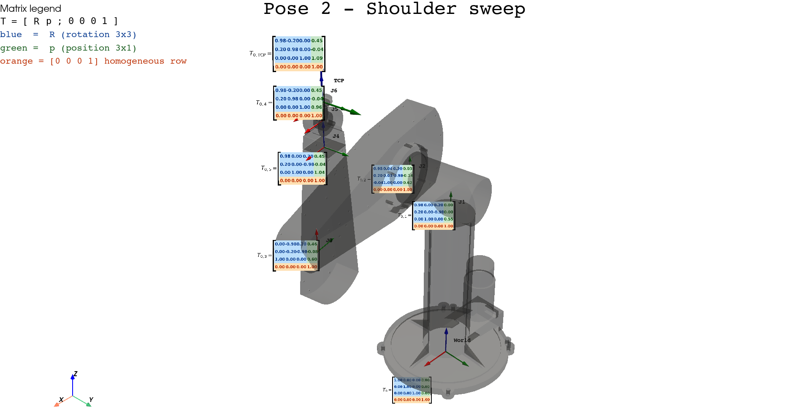

# Robot Kinematics Visualizer



A small interactive 3D viewer that **shows you what a transformation matrix
actually means** on a real industrial robot (the classic Puma 560), as the
robot moves through a guided sequence of poses.

If you have ever stared at a forward-kinematics formula and wondered:

> *“What does each cell of `T_{0,i}` mean? Why is the rotation block 3×3? Why
> is the bottom row always `0 0 0 1`? Why does the position column tell me
> where the joint is in space?”*

this project tries to answer those questions visually.

## What you will see

The viewer opens a PyVista window showing:

* The **Puma 560 robot** as a translucent mesh, so you can see *through* it
  and watch the frames inside.
* A **World frame** at the origin and its identity matrix `T_0`.
* The **local frame** of each joint (J1 … J6) drawn as XYZ arrows
  (red = X, green = Y, blue = Z).
* The **TCP frame** (Tool Center Point) at the end of the kinematic chain.
* A **floating matrix** next to each frame — the homogeneous transform
  `T_{0,i}` from the world to that frame. The matrix follows the camera so
  the values are always readable.
* A **legend** in the upper-left corner explaining the colour code.
* A **pose name** centered at the top of the screen telling you what
  the robot is currently doing.

### Reading the matrices

Every floating matrix is a 4 × 4 homogeneous transform. Each region is
colour coded so you can immediately recognise its meaning:

| Region                  | Colour  | What it represents                                    |
| ----------------------- | ------- | ----------------------------------------------------- |
| 3×3 block (top-left)    | blue    | Rotation `R` — the orientation of frame *i* in world  |
| 3×1 column (top-right)  | green   | Translation `p` — the position of frame *i* in world  |
| Bottom row              | orange  | `[0 0 0 1]` — the homogeneous fingerprint of an SE(3) |

Each matrix is labelled `T_{0,i}` because it expresses the pose of frame
*i* **with respect to the world frame 0**.

`T_0` (the world matrix) is the identity, which is why all its diagonal
cells are `1.00` and the rest are `0.00`.

## The guided demo

Instead of an arbitrary jiggle, the robot loops through six poses chosen
to highlight different geometric ideas. Each pose holds for ~3 s, with a
smooth 2 s interpolation between them.

| # | Pose                  | Joint angles (deg)               | What it teaches                                                         |
| - | --------------------- | -------------------------------- | ------------------------------------------------------------------------ |
| 1 | Home / Identity        | `0, 0, 0, 0, 0, 0`               | Clean alignment with the world frame; matrices look almost like identity |
| 2 | Shoulder sweep        | `90, -20, 20, 0, 0, 0`           | Shows global inheritance — rotating J1 spins every downstream frame      |
| 3 | Elbow configuration   | `30, -70, 90, 0, 0, 0`           | The kinematic chain folds; frames start rotating strongly relative to each other |
| 4 | Wrist articulation    | `30, -40, 50, 90, -45, 120`      | Position barely changes, but the **TCP rotation** changes dramatically — perfect for understanding rotation matrices |
| 5 | Near singularity      | `0, 0, 0, 0, 0, 0`               | Arm fully stretched; many frames align — geometric "tension" you can feel |
| 6 | Folded pose           | `-90, 60, -80, 0, 45, 0`         | Many negative entries appear; axes flip and re-align in unintuitive ways |

The point of the demo is **not** that these poses are physically optimal —
each one just has a different geometric *personality*, so you can watch
the matrix values change in different ways.

The transitions are deliberately slow because that is where the learning
happens: as the joints sweep, you can watch sines and cosines slide
around the rotation block while the position column traces a 3D path.

## Quick start

```bash
uv sync
uv run python src/robot_kinematics_visualizer/main.py
```

The first time you run on a new machine the viewer needs to render every
animation frame as a matplotlib image and cache it on disk
(`.cache/matrix_cache_<hash>.pkl.gz`). This takes about a minute or two.

A pre-built cache is committed to the repo, so on a fresh clone the demo
should start almost immediately. If you change the rendering style
(DPI, colours, figure size, …) the cache is invalidated automatically
and rebuilt on the next run.

### Linux / WSL

You will need an X server (WSLg on Windows 11 works out of the box;
otherwise VcXsrv or similar). The viewer is a desktop OpenGL window.

## How it works (peek under the hood)

Forward kinematics is computed by `roboticstoolbox-python`
(`robot.fkine_all(q)`), which returns the world transform of every link.
For each frame *i* we then:

1. Build XYZ arrows from canonical templates and apply
   `actor.user_matrix = T` to position them — no geometry rebuilding.
2. Render the matrix `T_{0,i}` once with matplotlib (rotation/position/
   homogeneous regions in their colours, brackets, prefix `T_{0,i} =`).
3. Wrap the image as a VTK texture on a billboarded plane (`vtkFollower`)
   that always faces the camera.

During the live animation we look up cached textures and call
`SetTexture` + `SetPosition` on the existing actors, which is essentially
free — so the playback is smooth and shows continuous, value-by-value
updates of the matrices instead of jumps.

## Recording the visualisation

The viewer is fine to capture with OBS Studio (or any screen recorder).
For a higher-resolution render you can bump `window_size` in
`pyvista_viewer.py:show_robot_viewer` and re-enable
`plotter.enable_anti_aliasing("ssaa")`.

## Dependencies

* [`uv`](https://github.com/astral-sh/uv) — environment & package manager
* `numpy<2`
* `roboticstoolbox-python`
* `spatialmath-python`
* `pyvista`, `trimesh`, `pycollada`
* `matplotlib`, `Pillow`

## Credits

The Puma 560 URDF and meshes ship with `roboticstoolbox-python`. This
project just adds the educational frame/matrix overlay on top.
